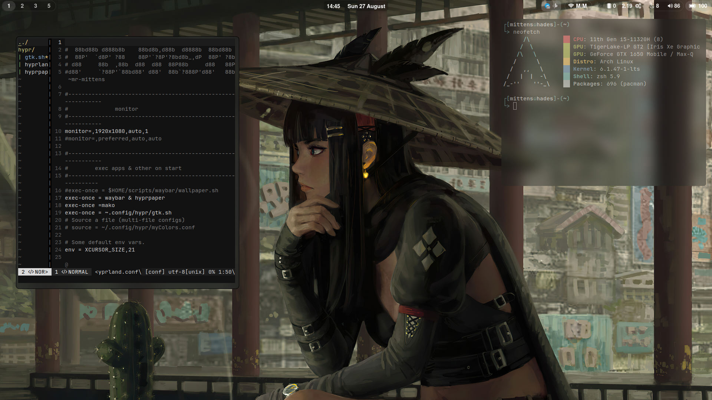
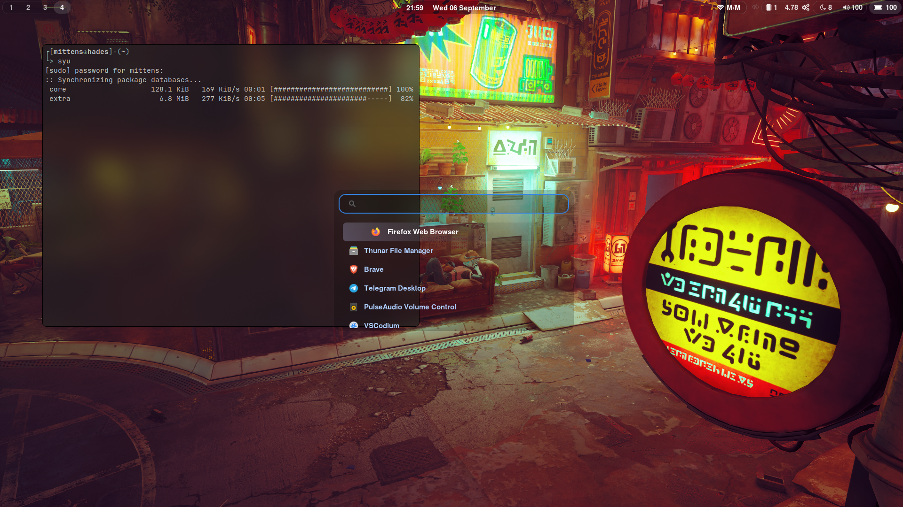

 
 
                                                  
An elegant hyprland config coming with less bloat, smooth workflow and aesthetic black theme 

- minimal setup with Archlinux
- I just usually forget things so if you are new to Window managers this space will save you !
- vimrc without bloated plugins.

</div>
<br>

___
<div align="">

Install Scripts & other
===========
>Arch install 
<div align="left">
  <tr>
    <th> Arch </th>
    <td><code>bash <(curl -s https://raw.githubusercontent.com/Mr-Mittens/Scripts/arch/arch-install.sh)</code></td>
  </tr>

<br>

> [Hyprland Script](https://github.com/Mr-Mittens/Scripts/blob/main/hyprland/post-install.sh)
 
**If you have arch already installed your (way) then only refer to hyprland script otherwise it's automated !** 
    
</div>


<br>

<br>

## Essential packages :
```
hyprland hyprpaper vim wayland-protocols waybar-hyprland brightnessctl make wlroots pipewire pipewire-alsa pipewire-pulse pipewire-jack wireplumber xdg-desktop-portal-wlr grim slurp sddm 

```
<br>

## Additional packages :
```
      alacritty thunar pavucontrol bluez mpv mako neofetch btop swaybg swayidle swww lxappearance  
```

<br>


## Basic keybindings

> **Note** applications that are only necessary are included in the base-installer scripts.

#### Apps

| Keybind                                                  | Action                           |
| -------------------------------------------------------- | -------------------------------- |
| <kbd>⊞ Super</kbd> <kbd>X</kbd>                          | Terminal <sup>(alacritty)</sup>  |
| <kbd>⊞ Super</kbd> <kbd>Z</kbd>                          | App Launcher <sup>(Wofi)</sup>   |
| <kbd>⊞ Super</kbd> <kbd>F</kbd>                          | File manager <sup>(Thunar)</sup> |

#### Other

| Keybind                                                | Action                     |
| ------------------------------------------------------ | -------------------------- |
| <kbd>⊞ Super</kbd> <kbd>[0,9]</kbd>                    | Change workspace           |
| <kbd>⊞ Super</kbd> <kbd>⇧ Shift</kbd> <kbd>[0,9]</kbd> | Move window to a workspace |
| <kbd>⊞ Super</kbd> <kbd>Q</kbd>                        | Kill a window              |
| <kbd>⊞ Super</kbd> <kbd>right click</kbd>              | Move a window              |
| <kbd>⊞ Super</kbd> <kbd>right click</kbd>              | Resize a window            |


>additional-pkgs

     `wl-clipboard` ---> `wayland clipboard utility`
     `ttf-jetbrains-mono`
     `ttf-font-awesome`
     `gvfs-mtp` --> `for automount and all `
     `mtpfs`    --> `for media transfer protocol`


>switching from `pulseaudio` to `pipewire`  
>install necessary packages   
```
sudo pacman -S pipewire pipewire-alsa pipewire-pulse pipewire-jack
```
>stop the PulseAudio services and enable pipewire services:

>first method

```
systemctl --user stop pulseaudio.socket
systemctl --user stop pulseaudio.service
systemctl --user disable pulseaudio.socket
systemctl --user disable pulseaudio.service
```
>second method 
```
systemctl --user enable pipewire.socket
systemctl --user enable pipewire.service
systemctl --user start pipewire.socket
systemctl --user start pipewire.service
```
---

>sound card detecting issue (in your pavucontrol if sound card is showing dummy output)

`aplay -1` if audio device not listed then :
`sudo vim /etc/modprobe.d/alsa-base.conf` & 
```
systemctl --user enable pipewire.service
systemctl --user start pipewire.service
systemctl --user enable pipewire-pulse.service
systemctl --user start pipewire-pulse.service

```

>screen sharing issue `OBS` install this pkg

```
    sudo pacman -S xdg-desktop-portal-hyprland  
```
or `xdg-desktop-portal-wlr` reboot .. try [wiki](https://wiki.archlinux.org/title/XDG_Desktop_Portal) for better understanding!

**will be posting troubleshooting & other utilities if you really love nerding out !** 

## Support Me !
[](https://odysee.com/@pegasx:d/hyprlandfirstrice:b)


